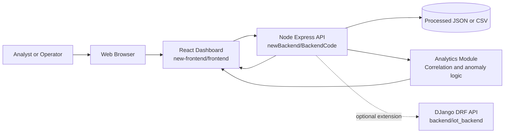
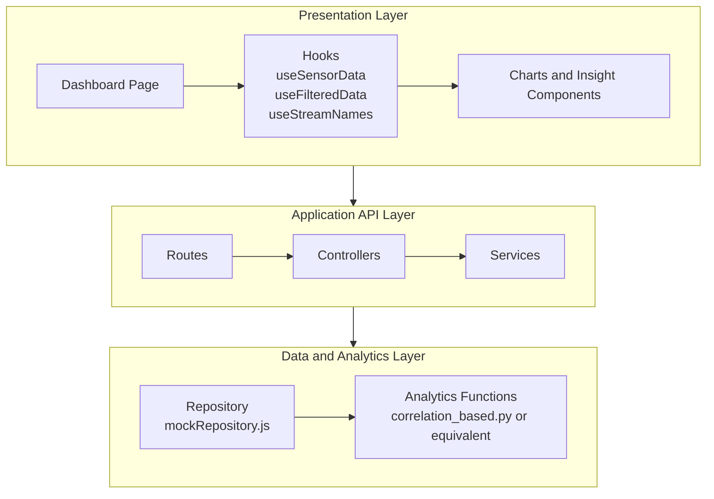
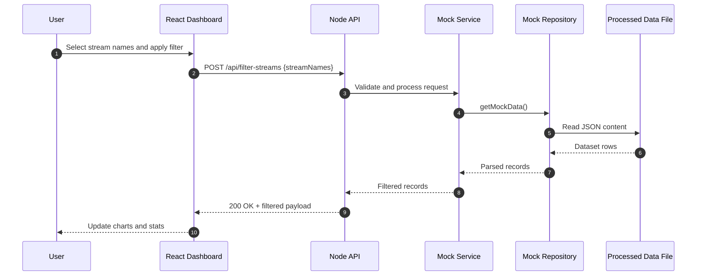
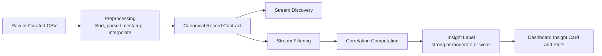
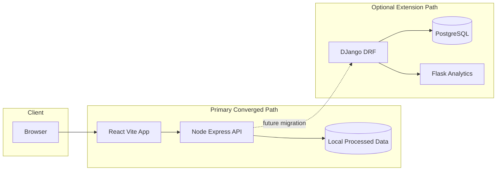
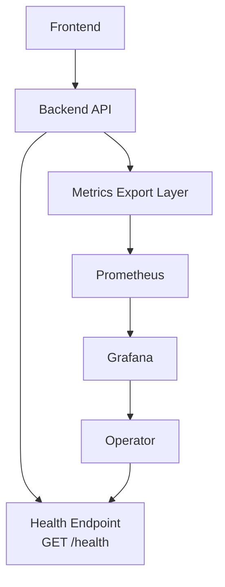
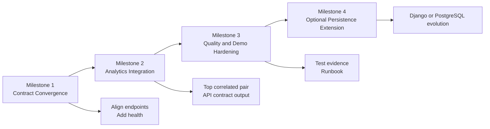

# High Level Design (HLD)

## Intelligent IoT Data Management Platform

Version: 2.1 (Repository Sync Update)

Date: 2026-05-14

---

## Table of Contents

1. [Document Overview](#1-document-overview)
2. [System Vision and Business Context](#2-system-vision-and-business-context)
3. [Scope Definition](#3-scope-definition)
4. [Stakeholders and User Personas](#4-stakeholders-and-user-personas)
5. [Architecture Drivers](#5-architecture-drivers)
6. [Current Landscape and Repository Reality](#6-current-landscape-and-repository-reality)
7. [Target High-Level Architecture](#7-target-high-level-architecture)
8. [Component View (Layer by Layer)](#8-component-view-layer-by-layer)
9. [Data Architecture and Canonical Contracts](#9-data-architecture-and-canonical-contracts)
10. [API Architecture and Interface Contracts](#10-api-architecture-and-interface-contracts)
11. [End-to-End Functional Flows](#11-end-to-end-functional-flows)
12. [Analytics and Intelligence Design](#12-analytics-and-intelligence-design)
13. [Non-Functional Requirements (NFRs)](#13-non-functional-requirements-nfrs)
14. [Security, Privacy, and Governance](#14-security-privacy-and-governance)
15. [Deployment and Environment Architecture](#15-deployment-and-environment-architecture)
16. [Observability, Monitoring, and Operations](#16-observability-monitoring-and-operations)
17. [Testing and Quality Strategy](#17-testing-and-quality-strategy)
18. [Risk Register and Mitigation Plan](#18-risk-register-and-mitigation-plan)
19. [Migration and Convergence Plan](#19-migration-and-convergence-plan)
20. [Open Decisions and Assumptions](#20-open-decisions-and-assumptions)
21. [Appendix: Mapped Repository Artifacts](#21-appendix-mapped-repository-artifacts)
22. [Architecture Diagram Pack](#22-architecture-diagram-pack)

---

## 1. Document Overview

### 1.1 Purpose

This High-Level Design (HLD) defines a complete architectural blueprint for the Intelligent IoT Data Management Platform. It is written to serve both academic and engineering objectives: it explains system intent, architecture boundaries, runtime interactions, data contracts, quality attributes, and delivery roadmap in enough detail to support implementation, demonstration, and assessment.

### 1.2 Intended Audience

- Technical assessors evaluating architecture quality and rationale.
- Developers implementing frontend, backend, and analytics modules.
- Data science contributors operationalizing algorithmic prototypes.
- Project leads coordinating milestones, risks, and integration.

### 1.3 How to Read This HLD

- Sections 2-7 describe why the system exists and the chosen architectural direction.
- Sections 8-12 describe what the system is and how core flows execute.
- Sections 13-18 describe quality, security, operational readiness, and risk posture.
- Sections 19-21 provide practical transition and traceability to repository assets.

---

## 2. System Vision and Business Context

The platform addresses a common IoT problem: large volumes of time-series sensor data are collected, but practical decision support is weak without integrated analytics and interpretable visualization.

The system therefore provides a modular pipeline for:

1. ingesting and serving sensor streams,
2. filtering and contextualizing data by selected streams/time windows,
3. computing statistical relationships (for example, correlations and outlier signals), and
4. presenting interpretable results via an interactive dashboard.

### 2.1 Strategic Objective

Deliver a coherent, demonstration-ready intelligent IoT analytics platform that connects software engineering structure (services, APIs, UI, operations) with data science outcomes (correlation insight, anomaly discovery).

### 2.2 Problem Statement

Without architectural convergence, prototype-heavy repositories often suffer from stack fragmentation, endpoint mismatches, inconsistent data schema assumptions, and unstable demo execution. This project currently exhibits those symptoms and requires a controlled architecture convergence plan.

---

## 3. Scope Definition

### 3.1 In Scope (Target Delivery)

- A unified runtime path centered on:
  - React dashboard (`new-frontend/frontend`),
  - Node/Express API (`newBackend/BackendCode`),
  - curated analytics logic integrated behind API contracts,
  - canonical JSON/CSV sensor payloads.
- Stream discovery, stream filtering, and dashboard visual analytics.
- Correlation-based insight for selected streams and selected windows.
- Baseline operational readiness with health checks and reproducible startup.

### 3.2 Out of Scope (Current Iteration)

- Full enterprise IAM, RBAC, and SSO lifecycle.
- Multi-region or Kubernetes-grade production deployment.
- Full MLOps model lifecycle orchestration with feature stores and model registries.
- High-frequency streaming guarantees at industrial telemetry scale.

### 3.3 Success Criteria

- End-to-end UI -> API -> analytics -> visualization flow works reliably.
- One canonical data contract is consistently honored.
- Key user journeys execute without manual patching of code during demo.
- Architecture documentation and implementation are aligned.

---

## 4. Stakeholders and User Personas

### 4.1 Primary Stakeholders

- Platform developers (frontend/backend integration).
- Data science contributors (algorithm adaptation and validation).
- Assessment panel and supervisors.
- Future maintainers onboarding into the project.

### 4.2 User Personas

1. Analyst user
   - Selects streams and time ranges.
   - Interprets correlation and anomaly behavior.
   - Exports insights for reporting.

2. Technical operator
   - Starts services and verifies health.
   - Diagnoses API failures and data contract issues.
   - Maintains runbook consistency.

3. Data scientist
   - Prototypes algorithms on historical datasets.
   - Promotes reusable functions into runtime services.
   - Compares algorithm output behavior across windows.

---

## 5. Architecture Drivers

### 5.1 Functional Drivers

- Multi-stream sensor data visualization.
- Stream-wise filtering and selected-window analysis.
- Correlation insight and anomaly-oriented interpretation.
- Simple and stable interfaces between UI, API, and analytics.

### 5.2 Non-Functional Drivers

- Reliability: predictable demo startup and consistent endpoint behavior.
- Maintainability: modular code ownership and explicit layering.
- Reproducibility: clear, low-friction setup for evaluators.
- Performance: responsive dashboard and manageable processing latency.

### 5.3 Constraint Drivers

- Academic timeline and bounded implementation capacity.
- Existing repository includes multiple parallel technology paths.
- Must preserve existing data science value while reducing integration complexity.

---

## 6. Current Landscape and Repository Reality

The repository now reflects merged contributions from multiple teams and contains parallel prototypes and service variants:

- Frontend prototype A: `frontend` (React/Vite app with auth screens, analyze panel, export flow, and MUI theme toggling).
- Frontend prototype B: `new-frontend/frontend` (dashboard-focused implementation).
- Backend prototype A: `backend/iot_backend` (Django + DRF + model-backed API).
- Backend prototype B: `newBackend/BackendCode` (Node/Express file-backed API).
- Analytics prototype services:
  - `data_science/development/server.py` (Flask /analyze),
  - `data_science/development/server_corr.py` (Flask correlation and CSV outputs),
  - algorithm modules in `algorithms/` and exploratory notebooks in `correlation_study/`.

### 6.1 Architectural Implication of Current State

This diversity is useful for experimentation but increases integration risk. Specifically:

- endpoint naming diverges across frontend and backend,
- data schemas vary by source,
- operational model is split across Node, Django, and Flask pathways,
- production narrative for assessment remains ambiguous.

### 6.2 Design Decision

Converge to one primary execution path while treating other stacks as controlled extension paths.

Primary path for delivery:

1. `new-frontend/frontend`
2. `newBackend/BackendCode`
3. Selected analytics logic integrated through API contracts
4. Curated dataset source (JSON/CSV)

Secondary/extension path:

- Django/DRF model-backed API remains as future data-layer evolution.

---

## 7. Target High-Level Architecture

### 7.1 Logical Architecture (Primary Runtime)

```text
[User Browser]
      |
      v
[React Dashboard]
      |
      v
[Node/Express API Layer]
      |
      +--> [Data Repository (JSON/CSV)]
      |
      +--> [Analytics Module (correlation/anomaly functions)]
```

### 7.2 Layered Responsibility Model

1. Presentation Layer (React)
   - User interaction, selection controls, chart rendering, insight cards.

2. Application/API Layer (Node/Express)
   - Contract enforcement, request validation, orchestration, error shaping.

3. Analytics Layer (Reusable functions)
   - Deterministic computations for correlation and anomaly indicators.

4. Data Layer (File now, DB optional)
   - Current: local processed JSON/CSV.
   - Future: normalized persistence using Django + PostgreSQL.

### 7.3 Architectural Principles

- Single source of truth for runtime API contracts.
- Thin controller, reusable service, isolated repository pattern.
- Deterministic analytics functions with explicit inputs/outputs.
- Explicit and stable canonical sensor record contract.
- Extension-friendly design without forcing premature infrastructure complexity.

---

## 8. Component View (Layer by Layer)

## 8.1 Presentation Layer: React Dashboard

Primary codebase: `new-frontend/frontend`

Key component groups (updated with PR #71 frontend integration):

- Pages and routing
  - `src/pages/HomePage.jsx`
  - `src/pages/DashboardPage.jsx`
  - `src/pages/Login.jsx`
  - `src/pages/RegistrationPage.jsx`
  - `src/pages/ForgotPassword.jsx`
- Dashboard orchestration
  - `src/components/Dashboard.jsx`
  - `src/components/Layout.jsx` (shared shell)
  - `src/components/ProtectedRoute.jsx` (route guard)
  - `src/components/Navbar.jsx`, `src/components/Footer.jsx`
  - `src/components/DatasetCard.jsx`
- Input controls
  - stream selector, interval selector, time selectors
- Visual output
  - line charts, scatter plot, correlated pair panel, stream stats
- Data hooks
  - `useSensorData`, `useFilteredData`, `useStreamNames`, `useTimeRange`

Responsibilities:

- Collect user intent (streams, window, interval).
- Render progressively richer visualization as selection depth increases.
- Avoid direct filesystem assumptions in final architecture.
- Support authenticated UX flow before entering protected Home/Dashboard routes.

Current gap observed:

- `useSensorData` currently defaults to mock mode and requests `/api/sensor-data` in live mode, while backend exposes `/api/streams`. This is a contract mismatch risk that must be normalized.

## 8.2 API Layer: Node/Express Service

Primary codebase: `newBackend/BackendCode`

Current implementation structure:

- Server bootstrap: `server.js`
- Routes: `routes/mock.js`
- Controller: `controllers/mockController.js`
- Service: `services/mockService.js`
- Repository: `repositories/mockRepository.js`

Current exposed API (through `/api` mount):

- `GET /api/streams`
- `GET /api/stream-names`
- `POST /api/filter-streams`
- `GET /api/data-profile`
- `POST /api/top-correlated-pair`

Service-level endpoint:

- `GET /health`

Repository behavior:

- Reads file from `PROCESSED_DATA_PATH` via `.env`.
- Parses JSON synchronously and returns all entries.

Benefits of this structure:

- Good separation between transport logic and data access.
- Easy replacement of repository (file -> DB) without rewriting controller contracts.

Backend security integration update (PR #70):

- Upstream merged lightweight authentication support using bcrypt + JWT + middleware.
- Architecture intent is to protect selected routes with bearer-token validation while keeping read-only/open demo routes configurable.
- Supporting backend modules introduced in that stream include `middleware/authMiddleware.js` and token/hash utility helpers.

Current convergence notes:

- `GET /health` is implemented in `newBackend/BackendCode/app.js` and used for operational verification.
- `useSensorData` live-mode path (`/api/sensor-data`) is still not aligned with Node route naming (`/api/streams`), so contract normalization or an alias remains required.

## 8.3 Optional Data Service Layer: Django + DRF Path

Codebase: `backend/iot_backend`

Key artifacts:

- Models: `timeseries/models.py`
- DRF viewsets: `timeseries/views.py`
- Router endpoints through `timeseries/urls.py` and `iot_backend/urls.py`

Current endpoint family:

- `GET /api/data/` (time series model records)
- `GET /api/processed/` (processed sensor records)

Role in HLD:

- Not primary runtime for current converged demo.
- Strategic evolution path for persistent, model-backed data serving.

DB stream update reference (external fork activity):

- Repository: `https://github.com/FarrisBaboo/Intelligent-IoT-Data-Management`
- DB-related commit trail indicates ongoing ingestion and endpoint hardening work:
  - `5e04d8e` Implement ingestion logic and models
  - `89e7d28` Add controllers/service/repo for DB and ingest fixes
  - `bffcaba` Fix mock connection to DB
  - `c92a28f` Fix DB ingestion pipeline and update dataset/series endpoints

Architecture interpretation:

- The project now has a clearer persistence-evolution stream (file-backed -> DB-backed).
- Canonical runtime still documents file-backed Node path as primary, while DB-backed path is treated as integration-ready extension pending full upstream convergence.

## 8.4 Analytics Service/Module Layer

Available analytics assets:

- Flask APIs in `data_science/development/server.py` and `server_corr.py`
- Correlation outlier function in `algorithms/correlation_based.py`

Role in target architecture:

- Extract deterministic algorithmic functions and integrate in a stable runtime contract.
- Keep notebooks and exploratory scripts as research assets, not runtime dependencies.

### 8.5 Frontend Integration Update (PR #71)

PR reference: `https://github.com/DataBytes-Organisation/Intelligent-IoT-Data-Management/pull/71`

Key architecture-facing updates from this frontend stream:

- Route model expanded to include login/registration/forgot-password pages.
- Protected route pattern introduced for `/home` and `/dashboard/:id`.
- Shared layout introduced for consistent navbar/footer wrapping.
- Homepage redesign and dataset card presentation added to improve discoverability of dataset entry points.
- New auth service client (`src/services/authClient.js`) introduced as a seam for backend auth integration.

HLD implication:

- The platform now has an explicit presentation-layer split between public auth routes and authenticated analytical routes.
- This strengthens separation of concerns and improves readiness for future backend-auth convergence.

---

## 9. Data Architecture and Canonical Contracts

### 9.1 Canonical Record Model

```json
{
  "created_at": "2025-03-19T15:01:59.000Z",
  "entry_id": 3242057,
  "Temperature": 22.0,
  "RH Humidity": 41.0,
  "Voltage Charge": 12.5,
  "was_interpolated": false
}
```

### 9.2 Contract Rules

- Mandatory fields: `created_at`, `entry_id`.
- Dynamic sensor keys are allowed and discovered at runtime.
- Values should be numeric where meaningful; missing values use `null`.
- Optional lineage field: `was_interpolated`.

### 9.3 Data Lifecycle (Current)

1. Dataset curated in CSV/JSON.
2. Processed file path provided through environment variable.
3. Repository reads file and emits records.
4. Service layer filters and projects selected streams.
5. Frontend receives filtered records and computes visualization-specific transforms.

### 9.4 Data Quality Considerations

- Timestamp consistency: enforce ISO8601 parseability.
- Numeric coercion strategy: controlled parsing before charting.
- Sparse columns: tolerate absent keys and avoid chart crashes.
- Sampling and interval alignment: configurable for rolling analytics.

---

## 10. API Architecture and Interface Contracts

### 10.1 Existing Contract (Node API)

1. `GET /api/streams`
   - Returns full dataset array.

2. `GET /api/stream-names`
   - Returns array of stream names extracted from first record minus metadata keys.

3. `POST /api/filter-streams`
   - Request:
     ```json
     { "streamNames": ["Temperature", "Voltage Charge"] }
     ```
   - Response: records containing metadata plus selected stream keys.

### 10.2 Required Contract Stabilization

- Add `GET /health` with status and timestamp payload.
- Normalize frontend fetch path either by:
  - changing frontend to `/api/streams`, or
  - exposing `/api/sensor-data` alias.
- Define consistent error envelope.

Recommended response envelope for future hardening:

```json
{
  "status": "ok",
  "data": [],
  "message": "optional"
}
```

### 10.3 Error Semantics

- `400` for invalid `streamNames` payload.
- `404` for empty stream-name extraction scenarios.
- `500` for repository read/parse failures.

### 10.4 API Versioning Guidance

- Keep current unversioned routes during capstone delivery.
- Introduce `/api/v1` namespace once contracts are frozen and tested.

---

## 11. End-to-End Functional Flows

### 11.1 Flow A: Dashboard Initialization

1. User navigates to dashboard route.
2. Frontend requests stream metadata/data from API.
3. API reads source file through repository.
4. Frontend derives available stream list and initial time range.
5. UI renders controls and baseline instructions.

### 11.2 Flow B: Stream Selection and Filtering

1. User selects one or more streams.
2. Frontend submits selected stream names for filtered dataset retrieval (or local hook-based filter, depending on current implementation mode).
3. API validates payload and returns projection.
4. Frontend updates chart and statistics cards.

### 11.3 Flow C: Correlation Insight Path

1. User selects at least two/three streams depending on analysis mode.
2. System computes pairwise/rolling correlation output.
3. Most correlated pair is identified.
4. Scatter and trendline view is rendered.
5. User interprets relation strength in context window.

### 11.4 Flow D: Health and Operational Check

1. Operator invokes `/health`.
2. API returns service status and timestamp.
3. Startup script or monitoring probe marks service as healthy.

---

## 12. Analytics and Intelligence Design

### 12.1 Analytics Objective

Provide interpretable, deterministic analytics that can be explained to non-ML users while still being technically rigorous for data science evaluation.

### 12.2 Current Available Methods

- Correlation-based outlier identification (`algorithms/correlation_based.py`).
- Flask-driven analysis endpoints (`/analyze`, `/analyze-corr`, `/analyze-csv`) for exploratory and export workflows.
- Expanded detector portfolio from DS stream (`Yashdeep22` fork), including threshold, LOF, IQR, COPOD, and volatility/level-shift variants under a common benchmarking workflow.

Data science stream reference:

- Repository: `https://github.com/Yashdeep22/Intelligent-IoT-Data-Management`
- Representative commits:
  - `2ead71a` clean ThresholdAD detector integration
  - `2707a31` LOF detector integration
  - `a67ac40` LOF single-sample guard
  - `f31fad3` NAB label support for benchmark evaluation
  - `7ab182b` combined benchmark summary report

### 12.3 Productionization Strategy

- Keep algorithm inputs explicit: selected streams, time range, threshold/window.
- Return compact summary results for UI consumption.
- Isolate notebook-only logic from runtime modules.
- Preserve detector interface consistency so detector swaps do not require API contract rewrites.
- Maintain benchmark artifact generation as a separate evaluation pipeline, not a runtime dependency.

### 12.4 Candidate Insight Contract

```json
{
  "topPair": ["Temperature", "Humidity"],
  "coefficient": 0.89,
  "strength": "strong",
  "window": "selected-range"
}
```

### 12.5 Explainability Expectations

- Every metric exposed in UI should include a plain-language interpretation label.
- Visual artifacts (scatter/trendline/rolling plots) should correspond to computable backend values.
- Threshold-based classification should be documented and reproducible.

---

## 13. Non-Functional Requirements (NFRs)

### 13.1 Reliability

- Startup reliability target: all mandatory services reachable within 2 minutes.
- Health endpoint should support automated readiness checks.
- Failures should degrade gracefully with actionable UI/API messages.

### 13.2 Performance

- Initial dashboard meaningful render: target under 3 seconds on local developer machine.
- Filter action response: target under 1 second for moderate dataset size.
- Correlation computation: target under 2 seconds for selected stream subset.

### 13.3 Scalability

- Current design scales vertically for capstone dataset sizes.
- Repository abstraction supports future migration to DB-backed pagination and query pushdown.

### 13.4 Maintainability

- Clear layering and module ownership.
- Reusable hooks and utility segregation in frontend.
- Service/repository separation in backend.

### 13.5 Portability and Reproducibility

- Docker-based service packaging available in repository.
- Environment-variable-based file path configuration.
- Consistent setup steps should be captured in runbook.

---

## 14. Security, Privacy, and Governance

### 14.1 Authentication baseline (merged backend stream)

PR reference: `https://github.com/DataBytes-Organisation/Intelligent-IoT-Data-Management/pull/70`

- Authentication capability has been introduced via lightweight JWT flow and password hashing.
- Middleware-based authorization checks are intended to gate protected API routes.
- This establishes a practical baseline security posture for student-team delivery without full IAM/RBAC rollout.

### 14.2 Security convergence note

- Frontend auth route flow (PR #71) and backend JWT middleware (PR #70) should be connected through a single token issuance/refresh contract in the next integration increment.

### 14.1 Current Security Posture

- CORS enabled for development.
- No strong authentication/authorization boundary in converged runtime path yet.

### 14.2 Baseline Security Controls for Current Phase

- Input validation on all POST payloads.
- Restrict allowed upload/file paths to controlled directories.
- Standardized error handling that avoids leaking sensitive internals.
- Environment secrets in `.env`, excluded from version control.

### 14.3 Future Security Enhancements

- Token-based auth for API usage.
- Role-sensitive access for administrative operations.
- Audit logs for analysis requests and exports.
- Data retention and deletion policies.

### 14.4 Data Governance Notes

- Track source and processing lineage for datasets used in demos.
- Record interpolation/transformation metadata when applicable.
- Ensure reproducibility of reported analytics in submission artifacts.

---

## 15. Deployment and Environment Architecture

### 15.1 Local Development Mode

- Frontend: Vite dev server.
- Backend: Node/Express service.
- Optional analytics: Flask service for advanced endpoints.
- Data source: local curated files.

### 15.2 Containerized Path (Repository Assets)

`Docker/docker-compose.yaml` defines service topology including:

- PostgreSQL (`db`)
- Django backend (`backend`)
- React frontend via Nginx (`frontend`)
- cAdvisor, Prometheus, Grafana for monitoring stack

This compose stack reflects the broader prototype ecosystem and can be used as a reference architecture for operations concepts. It currently aligns more closely to the Django-centric path than the primary converged Node runtime path.

### 15.3 Environment Segmentation

- Development: rapid iteration and dataset experimentation.
- Demo/Staging: fixed dataset and pinned configuration.
- Future production: hardened contracts, auth, persistence, and observability.

### 15.4 Persistence Evolution Note

- Recent DB-focused stream work demonstrates transition readiness toward persistent storage and ingestion pipelines.
- Production-oriented deployment should prioritize the DB-backed endpoint family once schema, ingestion jobs, and route contracts are unified in upstream main.

---

## 16. Observability, Monitoring, and Operations

### 16.1 Operational Metrics

- API request count and response latency.
- Error-rate by endpoint (`4xx` and `5xx`).
- Dataset read failures and parse exceptions.
- Frontend render/error telemetry (future).

### 16.2 Health and Readiness

- Mandatory `/health` endpoint in primary backend path.
- Startup checklist must verify:
  - API reachable,
  - dataset path valid,
  - frontend API calls successful.

### 16.3 Monitoring Stack Opportunity

Existing Docker assets include Prometheus and Grafana, enabling future instrumentation rollout for demonstrable reliability engineering practices.

---

## 17. Testing and Quality Strategy

### 17.1 Backend Test Strategy

Minimum credible suite:

- health endpoint returns success,
- stream names are discoverable,
- invalid `filter-streams` request returns `400`,
- valid filter request returns projected keys.

### 17.2 Frontend Test Strategy

Minimum smoke checks:

- dashboard load with dataset,
- stream selection updates key components,
- error state appears for failed data fetch,
- correlation panel appears under multi-stream conditions.

### 17.3 Analytics Validation Strategy

- deterministic test fixtures for known correlation behavior,
- edge cases for low-variance and missing-value windows,
- threshold classification consistency checks.
- detector-specific guards (for example single-sample handling and label-shape handling),
- benchmark reproducibility checks across supported detectors using the same labeled datasets.

### 17.4 Quality Gate Recommendation

Before demo freeze:

1. endpoint contract validation,
2. canonical dataset sanity check,
3. walkthrough script dry run,
4. evidence capture (screenshots/log outputs).

---

## 18. Risk Register and Mitigation Plan

| Risk | Likelihood | Impact | Mitigation |
|---|---|---|---|
| Multi-stack confusion during demo | Medium | High | Freeze one primary path and label others as extensions |
| Frontend/backend endpoint mismatch | High | High | Contract alignment and compatibility alias |
| Inconsistent sensor schema across files | High | Medium | Canonical contract and dataset validation |
| Missing health/readiness behavior | Medium | Medium | Implement `/health` and startup checklist |
| Time overrun from architecture rewrites | Medium | High | Incremental convergence with milestone gates |
| Algorithm explainability gaps | Medium | Medium | Add interpretation labels and deterministic outputs |

---

## 19. Migration and Convergence Plan

### Milestone 1: Contract Convergence (1-2 days)

- Align frontend data fetch path with backend routes.
- Add `GET /health` in Node service.
- Validate `.env` dataset path behavior.

### Milestone 2: Analytics Integration (2-3 days)

- Promote one reusable correlation insight function.
- Serve result through API-ready JSON contract.
- Display insight card in dashboard.

### Milestone 3: Quality and Demo Hardening (1-2 days)

- Implement baseline tests and smoke checks.
- Finalize startup runbook.
- Produce architecture evidence and release notes.

### Milestone 4: Optional Extension Track

- Begin gradual migration to model-backed persistence (Django/PostgreSQL path) if required by assessment scope.

---

## 20. Open Decisions and Assumptions

### 20.1 Open Decisions

- Whether to preserve `/api/sensor-data` as compatibility alias or standardize exclusively on `/api/streams`.
- Whether analytics execution remains embedded in backend process or delegates to standalone Flask microservice.
- Whether final demonstration requires Dockerized all-services path or local dual-service path.

### 20.2 Working Assumptions

- Curated dataset quality is sufficient for meaningful correlation output.
- Evaluation prioritizes architectural coherence and integration evidence.
- Full enterprise security is not mandatory for this delivery phase.

---

## 21. Appendix: Mapped Repository Artifacts

### 21.1 Primary Runtime Artifacts

- Frontend: `new-frontend/frontend/src/components/Dashboard.jsx`
- Frontend hook: `new-frontend/frontend/src/hooks/useSensorData.js`
- Node server: `newBackend/BackendCode/server.js`
- Node routes: `newBackend/BackendCode/routes/mock.js`
- Node service: `newBackend/BackendCode/services/mockService.js`
- Node repository: `newBackend/BackendCode/repositories/mockRepository.js`

### 21.2 Secondary/Extension Artifacts

- Django models: `backend/iot_backend/timeseries/models.py`
- Django viewsets: `backend/iot_backend/timeseries/views.py`
- Flask analytics server: `data_science/development/server.py`
- Flask correlation server: `data_science/development/server_corr.py`
- Correlation algorithm: `algorithms/correlation_based.py`

### 21.3 Operations and Platform Artifacts

- Compose topology: `Docker/docker-compose.yaml`
- Backend container config: `Docker/Backend-Dockerfile`
- Frontend container config: `Docker/Frontend-Dockerfile`

---

## 22. Architecture Diagram Pack

This section provides embedded diagrams (Mermaid format) that can be rendered in Markdown viewers supporting Mermaid. The diagrams are aligned with the architecture decisions and flows described in Sections 7 through 19.

### 22.1 System Context Diagram



### 22.2 Layered Component Diagram (Primary Runtime)



### 22.3 End-to-End Sequence Diagram (Stream Filtering)



### 22.4 Data Processing and Insight Flow



### 22.5 Deployment View (Current Ecosystem)



### 22.6 Monitoring and Operations View



### 22.7 Convergence Roadmap Diagram



---

## Final Architecture Narrative for Presentation

The platform began as a multi-prototype ecosystem (React variants, Node API, Django API, Flask analytics, notebooks). This HLD formalizes convergence into one coherent delivery path that preserves analytics value while reducing integration ambiguity. The resulting architecture is modular, demonstrable, and extensible: a clean dashboard experience over stable API contracts with data-science-informed insights and a clear roadmap toward stronger persistence, monitoring, and production hardening.
